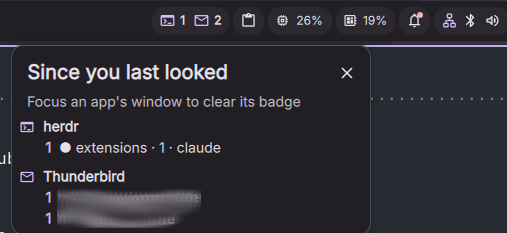

# Attention Badges — a DankMaterialShell plugin

Per-app badges in the DMS bar showing **what happened since you last focused that app**.
Focus the app's window and its badge clears.

Not an unread counter. A mailbox with 4000 unread messages shows nothing until something
new arrives.



The plugin knows **how** to watch things and nothing about **what**. Every watched app is a
small JSON file you drop in a directory — so out of the box it badges nothing, and what it
badges is entirely yours.

## How it works

Two inputs, both already present in DMS:

| Input | Source |
|---|---|
| what happened | `NotificationService.historyList` — every entry carries `appName`, `desktopEntry`, `summary`, `body`, `timestamp` |
| when you looked | `ToplevelManager.activeToplevel.appId` — the focused window's class |

...plus one optional third: a **command** you name, polled on an interval, which prints what
is currently waiting.

The **daemon** surface discovers providers, folds new events into a per-app, per-bucket count
and clears a target when its window class gains focus. It runs whether or not the bar widget
is placed, so counting never depends on the widget being visible. State is persisted through
`PluginService.savePluginState`, so a shell restart does not silently zero the badges.

The **widget** surface only renders. The daemon is the single writer — it even publishes the
target list for the widget and the settings page to read — so two monitors showing the widget
cannot disagree.

## Providers

Everything watched lives in `~/.config/DankMaterialShell/attention-providers/`. Nothing ships
enabled: a fresh install badges nothing until you put a provider there.

**The normal install is a git clone per provider**, each in its own subdirectory carrying a
`provider.json` and whatever helper scripts it needs:

```sh
git clone https://github.com/mkoester/dms-attention-badges-tb.git ~/.config/DankMaterialShell/attention-providers/thunderbird
```

```sh
dms ipc call attentionBadges rescan
```

Two exist so far, and they are the worked examples of each kind:

| Provider | Kind | Badges |
|---|---|---|
| [dms-attention-badges-tb](https://github.com/mkoester/dms-attention-badges-tb) | `notifications` | new mail per Thunderbird account |
| [dms-attention-badges-herdr](https://github.com/mkoester/dms-attention-badges-herdr) | `command` | herdr panes whose agent is waiting |

**[PROVIDER-IDEAS.md](PROVIDER-IDEAS.md)** is the answer to *what should I point this at?* —
the test for whether something belongs here at all, worked examples of each kind, the
anti-patterns, and what the format still cannot express.

### Keeping providers up to date

Providers are ordinary git clones, so nothing updates them on its own — the same as plugins,
which DMS also updates only when asked (`dms plugins update attentionBadges`). The plugin
ships a script for the whole directory at once:

```sh
~/.config/DankMaterialShell/plugins/attentionBadges/scripts/providers update
```

```
  herdr            ✓ up to date
  thunderbird      ↑ 3 commits -> updated
  my-notes         – not a git repo, skipped
2 checked, 1 updated.
```

It fast-forwards each provider clone and **never** merges or rebases: a provider you have
edited locally is reported and left alone, and the run exits non-zero so it can sit inside a
larger update routine. A flat `*.json` provider has no repo behind it and is only counted.
Provider files are watched, so an updated `provider.json` takes effect without a restart —
`dms ipc call attentionBadges status` confirms it.

`scripts/providers install <git-url> [directory-name]` is the clone above with the directory
and the follow-up `rescan` filled in.

A **single flat `*.json` file** directly in that directory also works, for a provider that
needs no scripts of its own. The subdirectory form is looked for at the fixed name
`provider.json`, so a repo's `README.md`, `package.json` or fixtures can never be mistaken for
a provider — and a subdirectory without one is simply not a provider, not an error.

The directory name is yours; a provider's identity comes from `id` inside the file.

### Counting vs. state

Two kinds of target, and the difference is load-bearing:

| mode | behaviour | right for |
|---|---|---|
| `count` | accumulates events, cleared by focusing the window | mail, chat, a build queue |
| `state` | replaced wholesale on every poll, no reset at all | anything you sit *inside* |

Counting is wrong for an app you sit inside. If you are already focused on it when something
starts waiting, no focus change ever happens, so a counter only grows; clearing on arrival
instead would pin it at zero. **Window focus cannot express "I dealt with that"** for such an
app — that is a granularity limit, not a bug, and no amount of tuning a counter fixes it.

A `notifications` source is always `count`: it observes arrivals, and an arrival is an event.
A `command` source is `state` unless it says otherwise.

### A notifications provider

```json
{
    "id": "thunderbird",
    "label": "Thunderbird",
    "icon": "mail",
    "source": {
        "kind": "notifications",
        "desktopEntry": "org.mozilla.Thunderbird",
        "bucket": {
            "source": "summary",
            "pattern": "^(\\S+@\\S+) received (\\d+) new messages?$",
            "nameGroup": 1,
            "countGroup": 2
        },
        "fallbackBucket": "other"
    },
    "reset": {
        "kind": "windowFocus",
        "windowClass": "org.mozilla.Thunderbird",
        "perBucketFile": "$XDG_STATE_HOME/thunderbird-attention-bridge/visits.json"
    }
}
```

| Field | Meaning |
|---|---|
| `id` | `^[a-z][a-zA-Z0-9]*$`. Becomes the state key and the settings key, so renaming it starts the count over. |
| `source.desktopEntry` / `appName` / `summaryPattern` | Which notifications belong to this app. At least one is required — a target with no criteria would swallow everything. |
| `source.bucket` | Optional. Splits the count by a regex over the notification text. Group `nameGroup` names the bucket; group `countGroup` (if given) says how many events the notification stands for. |
| `source.fallbackBucket` | Where anything that does not parse goes. Defaults to `other`. |
| `reset.windowClass` | **Read this off a live window**, never from a `.desktop` file — see below. |
| `reset.perBucketFile` | Optional; see per-bucket resets. |

Thunderbird emits `mk@example.de received 2 new messages` — so the account is the bucket and
the count comes from the message itself. It batches a poll into one notification and says how
many mails it stands for, so the badge counts *mails*, not popups.

Anything a counted app notifies about that does not parse lands in the **fallback bucket**
rather than being dropped. That is deliberate: the parse is a locale-dependent string match,
and a broken parse should look like a visible `other: 4`, not like silence. Thunderbird's
`Failed to connect to server …` notifications land there, which is correct — that is also
something you want to see.

### A command provider

```json
{
    "id": "herdr",
    "label": "herdr",
    "icon": "terminal",
    "source": {
        "kind": "command",
        "command": ["$HOME/.local/bin/herdr-attention", "--statuses", "blocked,done"],
        "intervalSeconds": 3,
        "mode": "state"
    }
}
```

The command must print exactly this on stdout:

```json
{"buckets": {"● homelab · 3 · claude": 1, "✓ extensions · 4 · codex": 1}}
```

Anything else — a non-zero exit, unparseable output, a missing `buckets` key, a count below 1
— clears that target for the tick and records the reason, visible in
`dms ipc call attentionBadges status`. Clearing rather than holding stale entries is
deliberate: for a `state` target, "the producer is gone" and "nothing is waiting" are the same
answer, and a badge frozen on old data is worse than an empty one.

It **polls; it does not subscribe.** A poll is stateless and self-healing: a restarted
producer, a dropped connection or a missed event all recover on the next tick rather than
freezing the badge silently. The cost is up to `intervalSeconds` of lag and one process spawn
per tick.

Note that a command provider runs a command you named, from a file you wrote, on every tick.
That is the same trust level as any DMS plugin (which is arbitrary QML), but it is worth
saying out loud.

**Give the command a path, not a bare name.** The shell usually runs from a systemd user unit,
whose `PATH` is the user manager's — typically `/usr/local/bin:/usr/bin:/bin` and **not**
`~/.local/bin`. A command that works perfectly in your terminal can therefore fail to spawn
here, with no output to explain it.

`$PROVIDER_DIR` is the answer, and the reason a provider is a directory: it expands to the
directory the provider file was read from, so a script shipped beside `provider.json` is
addressable with no symlink and no `PATH` entry. Install is then `git clone` and nothing else.

It has **no default** — used by a flat provider file, which has no directory of its own, it
expands to nothing and the spawn fails loudly rather than quietly finding some other binary of
the same name.

[dms-attention-badges-herdr](https://github.com/mkoester/dms-attention-badges-herdr) is the
worked example: it calls `herdr api snapshot`, keeps the panes whose agent is `blocked` (`●`,
waiting for your input) or `done` (`✓`, waiting for your review), drops the pane you are
currently focused on, and prints the contract.

### Per-bucket resets

A counted target may name a `reset.perBucketFile`. If some helper writes that file, focusing
the app clears only the buckets you actually opened instead of all of them:

```json
{"version": 1, "updatedAt": 1754923200000, "visits": {"mk@example.de": 1754923100000}}
```

**The file existing is the switch.** No file — the normal case — and the focus reset clears
the whole app, which is the only thing the compositor makes possible: it reports that a window
gained focus and nothing about what you looked at inside it. A file older than 7 days counts
as abandoned and the fallback returns, so an uninstalled helper cannot leave a dead file in
charge of the reset.

Counting is unaffected either way. For Thunderbird,
[thunderbird-attention-bridge](https://github.com/mkoester/thunderbird-attention-bridge)
is such a helper (**not published yet**) — it reports which accounts you opened and nothing
else, because the notification counts are already accurate and a second source of truth for
the same number is a liability. The format above is the entire interface, so any helper that
writes that file works.

### Paths

Provider files must not contain absolute home paths, so that they can be copied between
machines and users. `~`, `$HOME`, `$XDG_STATE_HOME`, `$XDG_CONFIG_HOME` and `$XDG_CACHE_HOME`
are expanded, in both `perBucketFile` and command arguments.

## Install

From the plugin registry:

```sh
dms plugins install attentionBadges
```

Or from a checkout, which is what you want while writing providers — the plugin directory
may be a symlink:

```sh
git clone https://github.com/mkoester/dms-attention-badges.git
```

```sh
mkdir -p ~/.config/DankMaterialShell/plugins
```

```sh
ln -s "$PWD/dms-attention-badges" ~/.config/DankMaterialShell/plugins/attentionBadges
```

The plugins directory does not exist on a machine that has never installed a plugin, and DMS
points its directory watcher at it *at startup* — so if `dms plugins list` does not show the
plugin after creating it, `dms restart`.

Then enable it in Settings → Plugins, and add the widget in **Settings → DankBar → Widgets**
(Left / Center / Right section). A plugin whose widget is greyed out there with *"Plugin is
disabled"* is not enabled yet.

## Verify

The badge is otherwise only observable by waiting for something to happen, so the daemon
exposes IPC:

```sh
dms ipc call attentionBadges status
```

`status` reports the focused window class, every discovered provider with the file it came
from, how each one is being reset, the last poll of each command provider (bytes, buckets,
error, stderr) — and every provider file that failed to load, **with its reason**. A rejected
file is never silently skipped: that would look exactly like an app which simply has not
notified yet.

```sh
dms ipc call attentionBadges rescan
```

```sh
dms ipc call attentionBadges reload
```

`rescan` goes back to the filesystem — use it after cloning or deleting a provider. `reload`
only re-parses what was already read, which is enough after editing a file in place.

```sh
dms ipc call attentionBadges clear
```

```sh
dms ipc call attentionBadges clearOne thunderbird
```

Right-clicking the widget also clears everything (it calls the same IPC, so there stays one
writer).

The window classes the reset depends on must be read off a **live window**, never from a
`.desktop` file — `StartupWMClass` is a prediction and is wrong for Thunderbird, which
advertises `thunderbird` and actually maps as `org.mozilla.Thunderbird`:

```sh
hyprctl -j clients | grep -i class
```

## Tests

```sh
./scripts/test
```

Covers `Rules.js` — the provider format and its validation, path expansion, matching, parsing,
folding history, resets, orphan pruning — using inline fixtures of each provider kind. The
providers themselves are tested in their own repos, which is where a locale-fragile regex or a
CLI's response framing belongs; keeping copies here would give one provider two sources that
drift.

It also checks `plugin.json` against the schema DMS ships, that every QML file the manifest
names exists, and that `docs/registry-entry.json` still agrees with it — the registry
validates that pair itself, but only in a PR, which is too late to find out.

The notification fixtures are shape-faithful copies of real entries from
`~/.cache/DankMaterialShell/notification_history.json` (addresses replaced), because a tidy
invented fixture would pass whatever the regex happens to do.

**The QML is not covered by any automated check.** `qmllint`/`qmlformat` from
`qt6-declarative` 6.11 exit non-zero on shipped, working DMS files that use `?.`/`??`
(verified against `Services/ClipboardService.qml`), so a green run would prove nothing. The
QML is validated only by loading it in a running shell.

## Known limits

- **A notification parse is a localized UI string.** A locale change breaks it silently
  except for everything landing in the fallback bucket.
- **Focus resets a whole app** unless a per-bucket helper is installed. The compositor
  reports which window got focus, not what you looked at inside it.
- **A window class cannot be guessed.** It varies per machine and per launcher, and a wrong
  one fails silently — `status` prints the focused class so it is one call to check.
- **Do-not-disturb does not hide anything from the counter** — verified 2026-08-15 in
  `Services/NotificationService.qml`: `doNotDisturb` gates only the popup, while history is
  fed from a separate condition. The real blind spot is the freedesktop `transient` hint,
  which keeps a notification out of history entirely, DND or not.

## License

MIT — see [LICENSE](LICENSE).
